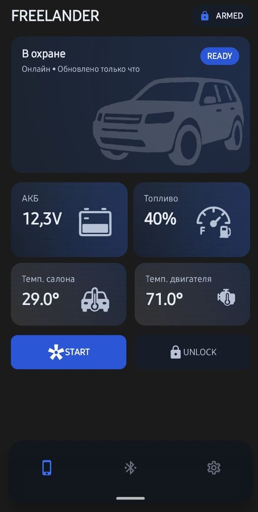
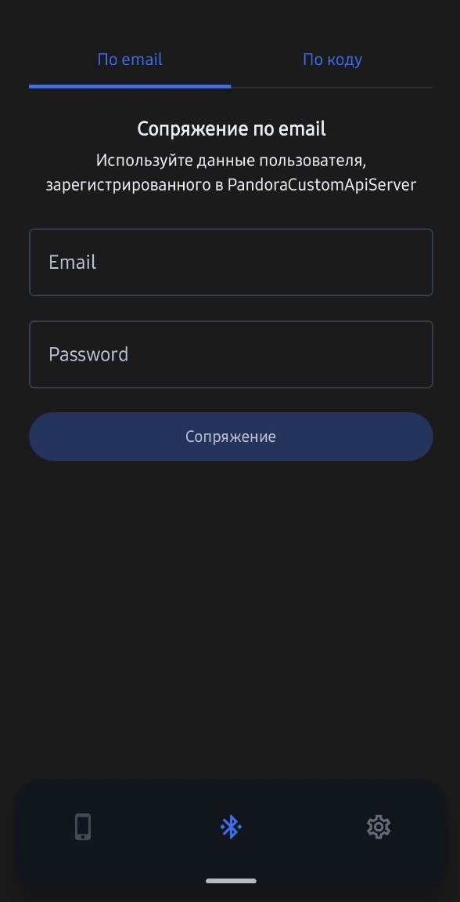

# PandoraCustomAndroidApp



**PandoraCustomAndroidApp** — это решение для Android и Wear OS, разработанное для взаимодействия с охранными системами Pandora через собственный сервис [PandoraCustomAPIServer](https://github.com/AgafonovSiberia/PandoraCustomApiServer).
Это **кастомный** клиент, позволяющий пользователям отслеживать, контролировать и управлять своими устройствами Pandora прямо со смартфона или смарт-часов.

Проект состоит из двух основных модулей:
*   **:app**: Приложение для Android.
*   **:wear**: Приложение для Wear OS.


### Мобильное приложение
*   **Сопряжение устройств.**
Сопряжение устройства с вашим аккаунтом в сервисе [PandoraCustomAPIServer](https://github.com/AgafonovSiberia/PandoraCustomApiServer).
Сопряжение возможно c помощью кода, полученного в PandoraCustomAPIServer или учётных данных вашего аккаунта.

*   **Dashboard.**
Текущее состояния автомобиля (состояние охранной системы, температура в салоне, температура двигателя, уровень топлива, уровень заряда АКБ)

*   **Управление.**
На текущий момент доступна только команда запуска/остановки двигателя

*  **Интеграция с Wear OS.**
Приложение использует `WearBridgeService` для прослушивания событий и синхронизации данных.
Приложение для часов не является автономным. Для доступа к API и сложной настройки используется приложение-компаньон на смартфоне.


### Приложение для Wear OS
*   **Управление.**
Быстрый доступ к исполнению команды запуска/остановки двигателя.

*   **Dashboard.**:
Текущее состояния автомобиля (состояние охранной системы, температура в салоне, температура двигателя, уровень топлива, уровень заряда АКБ)

*   **Автономность.**: 
Архитектура приложения не позволяет ему работать автономно (standalone). Для получения данных и отправки команд используется приложение со смартфона.


## Самостоятельная сборка приложения
### Предварительные требования
*   Android Studio
*   JDK 21
*   Экземпляр сервиса [PandoraCustomAPIServer](https://github.com/AgafonovSiberia/PandoraCustomApiServer).
*   Ключи подписи (Release Build)

* Для сборки `release` версии необходимо настроить keystore для подписи. Добавьте следующие свойства в ваш `gradle.properties` или переменные окружения системы:
```properties
PANDORA_KEYSTORE_PATH=/путь/к/keystore.jks
PANDORA_KEY_PASSWORD=пароль_ключа
PANDORA_KEY_ALIAS=алиас_ключа
PANDORA_STORE_PASSWORD=пароль_хранилища
```

### Самостоятельная сборка приложений
1.  Клонируйте репозиторий:
    ```bash
    git clone https://github.com/your-repo/pandorawear.git
    cd pandorawear
    ```

2.  Откройте проект в Android Studio.

3.  Выполните синхронизацию Gradle (Sync Project with Gradle Files).

4.  Запуск **Мобильного приложения**:
    *   Выберите конфигурацию `app`.
    *   Выберите подключенное Android устройство или эмулятор.
    *   Нажмите Run.

5.  Запуск **Приложения для часов**:
    *   Выберите конфигурацию `wear`.
    *   Выберите эмулятор Wear OS или подключенные часы.
    *   Нажмите Run.


## Отказ от ответственности
Данное программное обеспечение никак не связано и не одобрено ООО «НПО Телеметрия», владельца торговой марки Pandora.
Используйте его на свой страх и риск. Автор ни при каких обстоятельствах не несет ответственности за порчу или утрату вашего имущества и возможного вреда в отношении третьих лиц.

Все названия брендов и продуктов принадлежат их законным владельцам.

